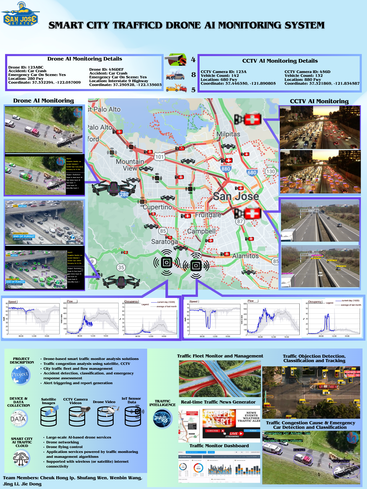

# Smart City AI Traffic Monitoring System with Machine Learning Models

### Project Description
Developed an IoT-based traffic flow prediction model, leveraging CCTV and drones for real-time traffic analysis and forecasting on highways. Innovated a Drone-Captured Video Analysis System to identify accidents, monitor emergency vehicles, and analyze vehicle movement, significantly enhancing congestion management and emergency response efficiency.

### Publishing Journal Paper
In progressing

### Modeling
Yolov8 nano with custom classes from drone video
* Car Crash
* Trank Rollover
* Car on Fire
* Police Car
* Fire Truck
* Ambulance

Yolov8 with vehicles detection dataset: Visdrone

### Integrated Drone Detection Model Demo: Highway Sence

